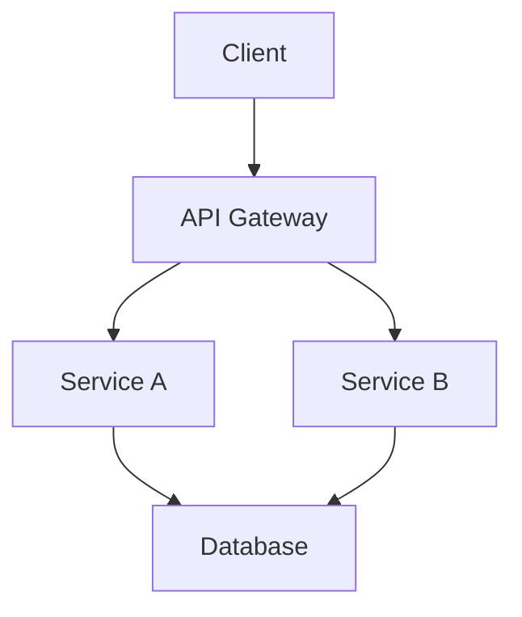

# Technical Documentation Example

This markdown file demonstrates how to write technical documentation.

## System Architecture

### Overview


## API Documentation

### Authentication

```python
import requests

def authenticate(username, password):
    """
    Authenticate user with the API

    Args:
        username (str): User's username
        password (str): User's password

    Returns:
        dict: Authentication token
    """
    response = requests.post(
        "https://api.example.com/auth",
        json={"username": username, "password": password}
    )
    return response.json()
```

### API Endpoints

| Endpoint | Method | Description |
|----------|--------|-------------|
| `/users` | GET | List all users |
| `/users/{id}` | GET | Get user details |
| `/users` | POST | Create new user |
| `/users/{id}` | PUT | Update user |
| `/users/{id}` | DELETE | Delete user |

## Code Examples

### Python Example

```python
class UserService:
    def __init__(self, db_connection):
        self.db = db_connection

    def get_user(self, user_id: int) -> dict:
        """
        Retrieve user from database

        Args:
            user_id: User's ID

        Returns:
            User data dictionary
        """
        return self.db.query(f"SELECT * FROM users WHERE id = {user_id}")
```

### JavaScript Example

```javascript
class UserService {
    constructor(dbConnection) {
        this.db = dbConnection;
    }

    async getUser(userId) {
        // Retrieve user from database
        const user = await this.db.query(
            'SELECT * FROM users WHERE id = ?',
            [userId]
        );
        return user;
    }
}
```

## Configuration

### Environment Variables

```env
# Database Configuration
DB_HOST=localhost
DB_PORT=5432
DB_NAME=mydb
DB_USER=admin
DB_PASSWORD=secret

# API Configuration
API_PORT=8000
API_DEBUG=true
```

## Troubleshooting

### Common Issues

1. **Connection Timeout**
   - Check network connectivity
   - Verify firewall settings
   - Ensure service is running

2. **Authentication Failed**
   - Verify credentials
   - Check token expiration
   - Ensure proper permissions

## Performance Considerations

- Use connection pooling
- Implement caching
- Optimize database queries
- Monitor resource usage

## Security Best Practices

- Use HTTPS
- Implement rate limiting
- Sanitize user input
- Follow OWASP guidelines